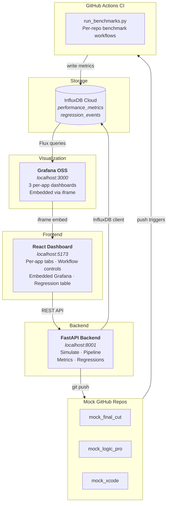
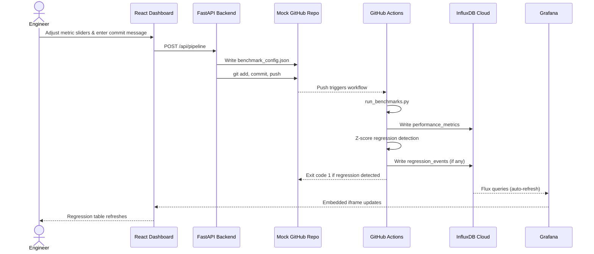
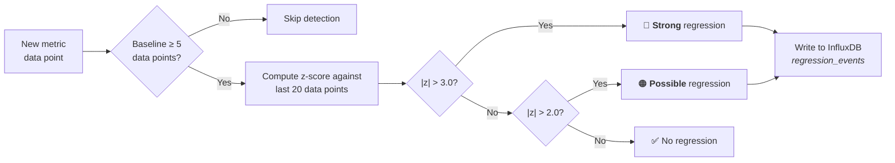

# Performance Lab

Automated performance regression detection platform that simulates a DevOps performance engineering workflow. The system monitors three mock macOS applications — **Final Cut Pro**, **Logic Pro**, and **Xcode** — each in its own GitHub repository with independent CI pipelines, per-workflow benchmark tracking, and statistical regression detection.

## Architecture



## Tech Stack

| Layer | Technology |
|-------|------------|
| Backend | Python 3.12+, FastAPI, Pydantic, NumPy |
| Frontend | React 19, TypeScript, Vite 7, Material UI 7 |
| Metrics DB | InfluxDB Cloud (Flux query language) |
| Visualization | Grafana OSS 11.6 (Docker, embedded via iframe) |
| CI/CD | GitHub Actions (per-repo benchmark workflows) |
| Package management | uv (Python), npm (Node.js) |

## Quick Start

### Prerequisites

- [Docker](https://www.docker.com/) (for Grafana)
- [uv](https://docs.astral.sh/uv/) (Python package manager)
- [Node.js](https://nodejs.org/) 18+ (for the frontend)
- An [InfluxDB Cloud](https://www.influxdata.com/products/influxdb-cloud/) account (free tier)

### Setup

1. **Clone and configure:**
   ```bash
   git clone https://github.com/thatdspguy/performance_lab.git
   cd performance_lab
   cp .env.example .env
   # Edit .env with your InfluxDB Cloud credentials
   ```

2. **Start everything:**
   ```bash
   ./start.sh
   ```
   This starts Grafana (Docker), the backend (port 8001), and the frontend (port 5173).

3. **Open the dashboard:**
   - Frontend: http://localhost:5173
   - API docs: http://localhost:8001/docs
   - Grafana: http://localhost:3000

## Project Structure

```
performance_lab/
├── backend/                    # Python FastAPI backend
│   ├── apps.py                 # App & workflow definitions (3 apps, 9 workflows)
│   ├── cli.py                  # CLI benchmark runner
│   ├── config.py               # Pydantic settings (reads .env)
│   ├── git_ops.py              # Git clone, commit, push operations
│   ├── main.py                 # FastAPI routes
│   ├── metrics.py              # InfluxDB read/write operations
│   ├── models.py               # Pydantic request/response models
│   ├── pipeline.py             # Orchestrates config write + git push
│   ├── regression.py           # Z-score regression detection
│   └── simulator.py            # Random metric generation (std = 10% of mean)
│
├── frontend/                   # React + Vite + TypeScript dashboard
│   └── src/
│       ├── App.tsx             # Per-app tab layout (Final Cut | Logic Pro | Xcode)
│       ├── api/client.ts       # Typed REST API client
│       ├── components/
│       │   ├── AppDashboard.tsx      # All-in-one per-app view
│       │   ├── GrafanaDashboard.tsx  # Embedded Grafana iframe
│       │   ├── MetricSlider.tsx      # Reusable slider component
│       │   ├── RegressionTable.tsx   # Regression event table
│       │   └── WorkflowControls.tsx  # Per-workflow metric sliders
│       └── types/index.ts      # Shared TypeScript interfaces
│
├── grafana/
│   ├── dashboards/             # Provisioned per-app dashboard JSONs
│   │   ├── final-cut-dashboard.json
│   │   ├── logic-pro-dashboard.json
│   │   └── xcode-dashboard.json
│   └── provisioning/           # Grafana auto-provisioning configs
│       ├── dashboards/dashboards.yml
│       └── datasources/influxdb.yml
│
├── mock_repo_templates/        # Template files for each mock GitHub repo
│   ├── run_benchmarks.py       # Standalone benchmark runner (shared)
│   ├── mock_final_cut/         # Final Cut Pro repo template
│   ├── mock_logic_pro/         # Logic Pro repo template
│   └── mock_xcode/             # Xcode repo template
│
├── tests/                      # pytest test suite (37 tests)
├── docs/                       # Additional documentation
│   ├── demo-scenario.md        # Scripted 20-commit demo with regressions
│   └── grafana-setup.md        # Grafana OSS setup guide
│
├── docker-compose.yml          # Grafana OSS service
├── start.sh                    # One-command startup script
├── pyproject.toml              # Python project config
└── .env.example                # Environment variable template
```

## How It Works

### Per-App Tabs

The dashboard has three tabs — one for each application. Each tab contains:
1. **Workflow Controls** — expandable accordion for each workflow with CPU, Memory, and Execution Time sliders
2. **Commit Section** — commit message field + "Commit & Push" button
3. **Performance Dashboard** — embedded Grafana dashboard (via iframe)
4. **Regressions** — table of detected regression events

### Workflows

Each application has three workflows with distinct performance profiles:

| Application | Workflows |
|---|---|
| **Final Cut Pro** | Importing Video, Editing Video, Exporting Video |
| **Logic Pro** | Loading Project, Real-Time Playback, Bouncing Final Mix |
| **Xcode** | Clean Build, Incremental Build, Run Unit Tests |

### Commit & Push Flow



### Regression Detection

Uses **z-score statistical analysis** with a sliding window:



## Mock Repositories

Each mock app lives in its own GitHub repository:
- [mock_final_cut](https://github.com/thatdspguy/mock_final_cut)
- [mock_logic_pro](https://github.com/thatdspguy/mock_logic_pro)
- [mock_xcode](https://github.com/thatdspguy/mock_xcode)

Template files for these repos are in `mock_repo_templates/`. Each repo contains:
- `run_benchmarks.py` — standalone benchmark runner (reads config, simulates metrics, writes to InfluxDB, detects regressions)
- `benchmark_config.json` — per-workflow metric configuration
- `.github/workflows/benchmark.yml` — CI workflow triggered on push to main

The Performance Lab backend auto-clones these repos into `repos/` at runtime.

## Grafana Dashboards

Three per-app Grafana dashboards are auto-provisioned via Docker Compose. Each dashboard has:
- Per-workflow rows (CPU, Memory, Execution Time time series)
- Regression event table
- Regression annotations on time series panels
- Workflow template variable for filtering

See [docs/grafana-setup.md](docs/grafana-setup.md) for detailed Grafana configuration.

## Demo Scenario

A scripted 20-commit demo scenario is available in [docs/demo-scenario.md](docs/demo-scenario.md). It tells a realistic development story for each app with gradual optimizations, dramatic regressions, partial fixes, and cascading issues.

## Running Tests

```bash
uv run pytest
```

All 37 tests cover: API endpoints, simulator, regression detection, git operations, pipeline, and CLI.

## API Reference

| Endpoint | Method | Description |
|---|---|---|
| `/api/apps` | GET | List all apps with workflow definitions |
| `/api/config` | GET | Get per-app Grafana dashboard URLs |
| `/api/simulate` | POST | Simulate a single workflow run |
| `/api/metrics` | GET | Query per-workflow metric history |
| `/api/regressions` | GET | Query per-workflow regression events |
| `/api/pipeline` | POST | Write config, commit & push to mock repo |
| `/api/repos/sync` | POST | Clone/pull all mock repos |

Full interactive API docs available at http://localhost:8001/docs when the backend is running.

## Environment Variables

| Variable | Description |
|---|---|
| `INFLUXDB_URL` | InfluxDB Cloud URL |
| `INFLUXDB_TOKEN` | InfluxDB API token |
| `INFLUXDB_ORG` | InfluxDB organization ID |
| `INFLUXDB_BUCKET` | InfluxDB bucket name (default: `performance_lab`) |
| `GRAFANA_FINAL_CUT_URL` | Grafana embed URL for Final Cut dashboard |
| `GRAFANA_LOGIC_PRO_URL` | Grafana embed URL for Logic Pro dashboard |
| `GRAFANA_XCODE_URL` | Grafana embed URL for Xcode dashboard |
| `MOCK_REPOS_DIR` | Directory for cloned mock repos (default: `repos`) |
| `CORS_ORIGINS` | Allowed CORS origins (default: `http://localhost:5173`) |
